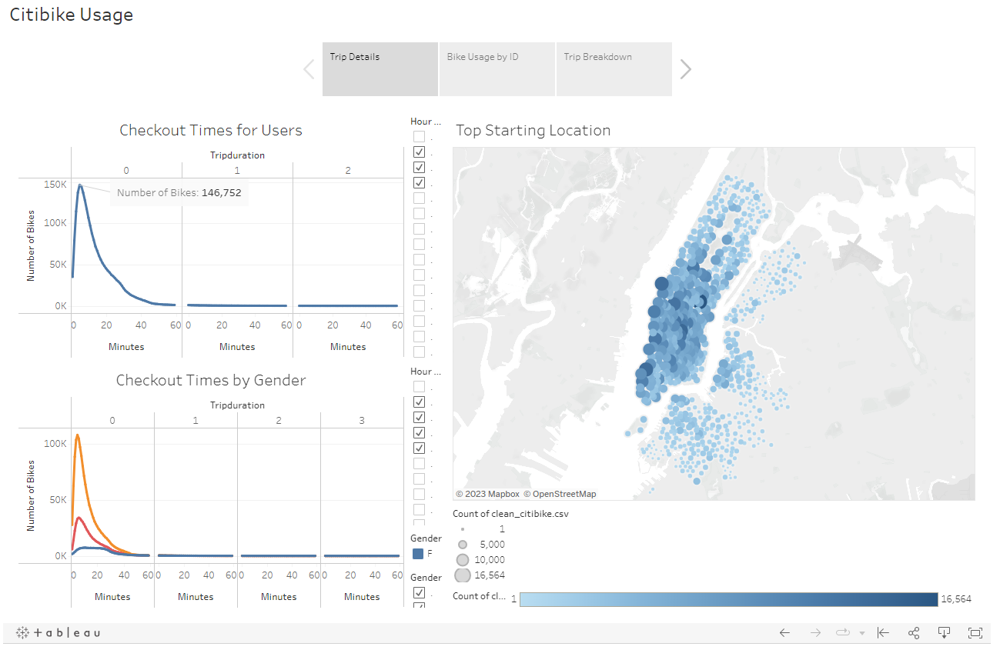
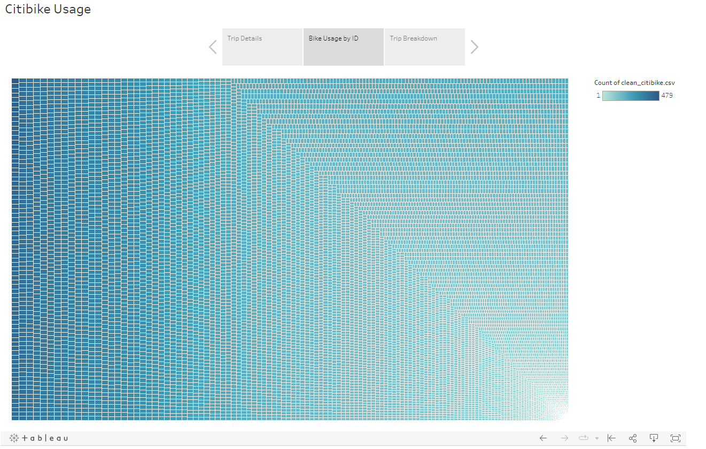
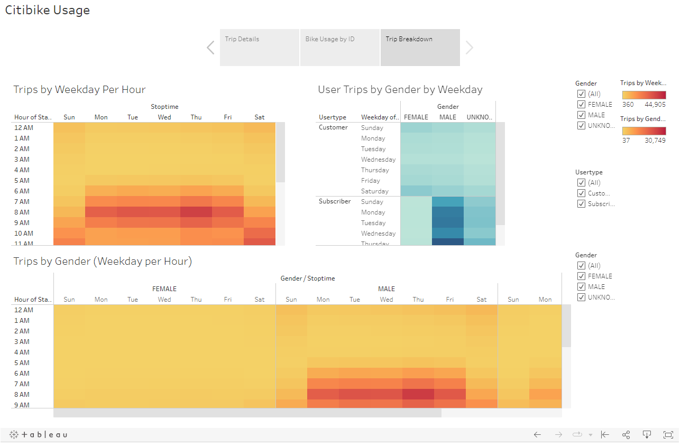

# bikesharing

[link to dashboard](https://public.tableau.com/app/profile/frank.passalacqua/viz/Citibike_Challenge_16743107095750/CitibikeUsage)

## Overview of Project
 
### Purpose

The purpose of the analysis is to create a Tableau Story to analyze Citibike data. 

## Results

The following Tableau Story gives in site into the Citibike user trends.

The "Trip Details" page shows how long users tend to ride for as well as the starting locations that are most likely to be used. One can see the most trips are 5 minutes long and made by males. When looking at the Map on the right it can be determined that many locations are used frequently across Manhattan.

The "Bike usage by ID" page shows some bikes are used much more frequently than other bikes. This may be due to some Bike being taken between 2 "Top Starting Locations" as shown on the previous page. Bike that are used less often may be stuck at in low traffic areas.

The "Trip Breakdown" page shows the number of trips vs. days of the week broken down multiple different ways. though interpreting all 3 charts one can conclude males are causing the spike in trips on all days of the week. 

## Summary

In conclusion most Citibikes are used for 1-40 minutes by males, some bikes are used much more often than other bikes, and bikes are most commonly used before and after typical work hours. There are 2 other visualizations that should be made. A visualization could be made to analyze average tip time by start location. Another visualization could be made to show the top destinations for a given starting location.
